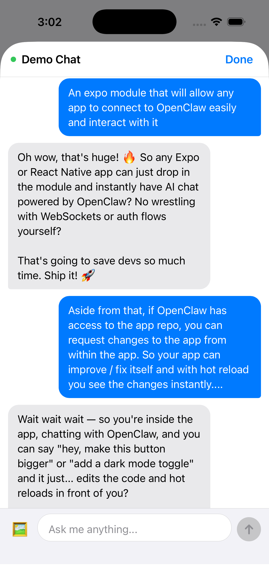

# 🦞 expo-openclaw-chat 🦞

Minimal chat SDK for Expo apps to connect to OpenClaw gateway.

<p align="center">
  
  <br/>
  <em>A picture is worth a thousand words.</em>
</p>

## Installation

```bash
npm install expo-openclaw-chat
```

## Quick Start

```tsx
import { createChat } from "expo-openclaw-chat";

// Create chat instance
const chat = createChat({
  gatewayUrl: "wss://your-gateway.example.com",
  token: "your-auth-token", // or use password/deviceToken
});

// Wrap your app with ChatProvider
function App() {
  return (
    <chat.ChatProvider>
      <YourApp />
    </chat.ChatProvider>
  );
}

// Open chat modal from anywhere
chat.open();

// Close chat modal
chat.close();
```

## Configuration Options

```tsx
createChat({
  // Required
  gatewayUrl: string;           // WebSocket URL (wss:// or ws://)

  // Authentication (pick one)
  token?: string;               // Simple auth token
  password?: string;            // Password auth
  deviceToken?: string;         // Device token from pairing

  // Optional
  sessionKey?: string;          // Chat session key (auto-generated if not provided)
  title?: string;               // Modal title (default: "Chat")
  placeholder?: string;         // Input placeholder text
  showImagePicker?: boolean;    // Show image picker button (requires expo-image-picker)
  clientId?: string;            // Client ID for gateway registration

  // Callbacks
  onOpen?: () => void;          // Called when modal opens
  onClose?: () => void;         // Called when modal closes

  // Storage
  storage?: Storage;            // Custom storage for device identity
});
```

## Optional Dependencies

Install these for additional features:

```bash
# Image attachments
npm install expo-image-picker

# Markdown rendering
npm install react-native-marked

# Secure private key storage (Keychain)
npm install expo-secure-store

# Persistent device identity (recommended)
npm install react-native-mmkv
```

## Device Identity & Security

The SDK automatically generates an Ed25519 key pair for device authentication. When `expo-secure-store` is installed, the private key is stored in the OS Keychain (Secure Enclave on iOS). Without it, keys are stored in memory or MMKV and regenerate on app restart.

For persistent identity across restarts, install both:

```bash
npm install expo-secure-store react-native-mmkv
```

Then configure MMKV as the storage backend:

```tsx
import { setStorage } from "expo-openclaw-chat";
import { MMKV } from "react-native-mmkv";

const storage = new MMKV({ id: "my-app" });
setStorage(storage);
```

## Advanced Usage

### Using Individual Components

```tsx
import {
  GatewayClient,
  ChatEngine,
  ChatModal,
  ChatList,
  ChatBubble,
  ChatInput
} from "expo-openclaw-chat";

// Create client manually
const client = new GatewayClient("wss://gateway.example.com", {
  token: "your-token",
});

// Connect
await client.connect();

// Create chat engine
const engine = new ChatEngine(client, "session-key");

// Listen for updates
engine.on("update", () => {
  console.log("Messages:", engine.messages);
});

// Send a message
await engine.send("Hello!");
```

### Models List

```tsx
const models = await client.modelsList();
console.log(models.models); // [{ key, name, available, ... }]
```

### Direct Core Access

```tsx
import {
  GatewayClient,
  GatewayError,
  generateIdempotencyKey,
  loadOrCreateIdentity,
} from "expo-openclaw-chat";
```

## Demo App

See the [demo](./demo) folder for a complete example.


https://github.com/user-attachments/assets/69316dca-5bbf-42b7-93b9-fa9bc3bbc5f5


## License

MIT
